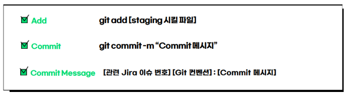

# Git 컨벤션

> JIRA, GIT, CODE에서 코드 작성 및 커밋 규칙을 작성합니다.
이를 통해 서로의 작업 내역, 이슈, 버그 등을 빠르게 캐치 할 수 있습니다.
> 

# GIT

### branch (Story)

```bash
git branch feature/FE/기능
git branch feature/BE/기능(story별)
```

### Default Branch

- master : 완성 된 코드들만 올라갈 수 있는 branch
- develop : 개발된 내용이 update 되는 branch
- test : 배포 전 테스트를 위한 branch
- release : 배포용 branch

### 커밋 룰 (Sub-task)



```tsx
git commit -m "[jira이슈 번호] 컨벤션 : 커밋메세지"
```

## 컨벤션


→ 정확한 작업 JIRA 없을시 epic 번호 사용

우아한 형제들의 Git-flow 전략 을 참고하여 관리했습니다.
 크게 BACKEND 와 FRONTEND 브랜치로 나누었고, 
기능이 완성될 때 BACKEND 또는 FRONTEND 브랜치에 merge 했습니다.
 하루의 작업이 끝나면 두 브랜치를 develop 브랜치에 merge했습니다.
 또한, 한 주가 끝날 때 develop 브랜치를 master 브랜치로 merge했습니다.
commit message는 .gitmessage 파일을 만들어서 통일시켰습니다.
################
# <타입> : <제목> 의 형식으로 제목을 아래 공백줄에 작성
# 제목은 50자 이내 / 변경사항이 "무엇"인지 명확히 작성 / 끝에 마침표 금지
# 예) refactor - 가독성을 위해 서브 시스템 X를

# 바로 아래 공백은 지우지 마세요 (제목과 본문의 분리를 위함)

################
# 본문(구체적인 내용)을 아랫줄에 작성
# 여러 줄의 메시지를 작성할 땐 ":"로 구분 (한 줄은 72자 이내)

---

# git 작업 최우선 사항

## merge는 다같이 무적권!!!!!

## merge완료 이후 다같이 pull 받기

## 이후 다시 브랜치 이동 이동 후 개인작업 재개

### 설정사항

gitlab에 deploy, develop 브랜치 생성  --> 가시성을 위함

모두 같이 pull을 받은 상태라면??

```
# 다같이 merge를 완료하고, 모두 병합 되었기 때문에 각 브랜치에도 모든 변경사항이 업데이트 되어있음
$ git checkout -b 브랜치명

# 작업시작
$ git commit -m "[이슈번호] 작업한 기능 명 : 상세정보"
$ git push
**
# 만약 공통적으로 수정해야하는 파일이 생겼다면?
# 수정 한 내용을 한명이 먼저 commit -> push -> merge

# 다른 사람이 급히 수정한 내용을 받을려고 할 때

$ git stash # 임시 저장

$ git checkout develop(merge 한 branch)
$ git pull

$ git checkout 개인작업branch

$ git stash apply
```
